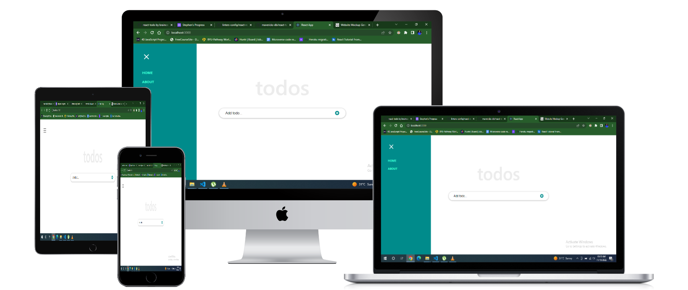

# To-Do App

## Built With

- HTML
- CSS
- JavaScript
- webpack
- React

## Website Mockup 📱 💻 🖥️



## Live Demo (not available)
[Live Demo Link](#)

## Install

Download all dependencies after cloning this repository. Run:
```
npm install
```
Run `npm start` to start live server.

To get a local copy up and running follow these simple example steps.
- Copy this [link](#)
- Open the terminal
- Run "git clone" and paste the link
- Install dependencies 
- Open this folder in your code editor
- Create a feature branch to work on
- Now you can edit and make a pull request

## Authors

👤 **Author1**

- GitHub: [@braince](https://github.com/braincee/)
- Twitter: [@annor0543](https://twitter.com/annor0543/)
- LinkedIn: [Stephen Annor](https://www.linkedin.com/in/stephen-annor/)
  
  
## 🤝 Contributing

Contributions, issues, and feature requests are welcome!

Feel free to check the [issues page](../../issues/).